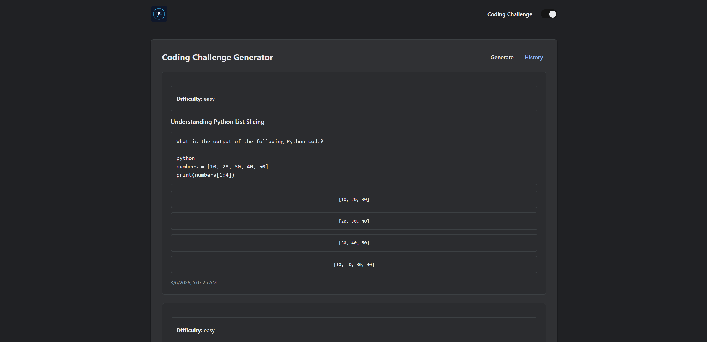

# Code Challenge Generator

## Overview

Code Challenge Generator is a full-stack AI web application that dynamically generates programming challenges using a language model API.

The project demonstrates practical integration of AI services into a production-style web architecture. A React frontend allows users to request coding challenges, while a FastAPI backend communicates with the OpenAI API to generate structured questions, answer options, and explanations.

The system is deployed on AWS using a cost-optimized architecture with a static frontend hosted on S3 and CloudFront, and a containerized backend running on EC2. Deployments are fully automated through GitHub Actions using OIDC authentication.

This project serves as a portfolio demonstration of modern cloud engineering practices including containerization, CI/CD pipelines, secure secret management, and full-stack AI application development.

---

## Live Demo

Production URL:

https://d1tsfobuj7g5p2.cloudfront.net

<p align="center">
  
</p>

Example API endpoint:

```
GET /api/quota
```

Example response:

```json
{
  "user_id": "local-dev",
  "quota_remaining": 50,
  "last_reset_date": "2026-03-05T23:20:47.829038"
}
```

---

# Application Architecture

The system follows a simple full-stack architecture:

```
User Browser
      │
      ▼
CloudFront CDN
 ├── S3 (React Frontend)
 └── EC2 (FastAPI Backend)
           │
           ▼
       OpenAI API
```

The frontend and backend are deployed independently while sharing the same CloudFront distribution. API requests are routed through `/api/*` to the backend.

---

# Tech Stack

## Frontend

- React 19
- Vite
- React Router
- Custom CSS
- Fetch API client

## Backend

- Python
- FastAPI
- Uvicorn
- SQLAlchemy ORM
- SQLite

## AI Integration

- OpenAI API

## Infrastructure

- AWS EC2
- Amazon ECR
- Amazon S3
- Amazon CloudFront
- AWS IAM
- AWS Systems Manager Parameter Store

## DevOps

- Docker
- GitHub Actions
- OIDC authentication for AWS

---

# Features

### AI Coding Challenge Generation

Users can generate programming challenges that include:

- challenge title
- programming question
- multiple choice answers
- correct answer
- explanation

Challenges are generated dynamically using an AI model and returned as structured JSON.

---

### Challenge History

Previously generated challenges are stored in a SQLite database and can be viewed in a history panel.

Each record includes:

- difficulty
- prompt
- answer options
- explanation
- timestamp

---

### Daily Quota System

A simple quota system prevents unlimited AI usage.

Quota records track:

- user ID
- remaining challenge generation
- last reset date

Quota resets every 24 hours.

---

### Robust AI Response Parsing

The backend includes defensive parsing to handle inconsistent formatting from AI responses.

Steps include:

1. Removing markdown code fences
2. Extracting the JSON object
3. Parsing the JSON payload
4. Validating required fields

This ensures malformed responses do not corrupt stored challenge data.

---

### Theme System

The UI supports light and dark modes using CSS variables.

Theme behavior:

- stored in `localStorage`
- applied using `data-theme` on the `<html>` element
- toggled through a UI switch

Dark mode uses a neutral gray palette inspired by Material Design and ChatGPT UI.

---

# API Endpoints

### Get Quota

```
GET /api/quota
```

Returns the remaining daily challenge quota.

---

### Generate Challenge

```
POST /api/generate-challenge
```

Request body:

```json
{
  "difficulty": "easy"
}
```

Response:

```json
{
  "title": "...",
  "prompt": "...",
  "options": ["A", "B", "C", "D"],
  "correct_answer_id": 1,
  "explanation": "..."
}
```

---

### Challenge History

```
GET /api/history
```

Returns previously generated challenges stored in the database.

---

# Cloud Architecture

The project uses a minimal AWS architecture designed for low cost while still demonstrating real production deployment patterns.

## Frontend

```
React + Vite build
        │
        ▼
     S3 Bucket
        │
        ▼
   CloudFront CDN
```

Static assets are deployed to an S3 bucket and distributed globally through CloudFront.

---

## Backend

```
FastAPI
   │
   ▼
Docker Container
   │
   ▼
Amazon ECR
   │
   ▼
EC2 Instance
```

The backend runs inside a Docker container on a single EC2 instance.

Container startup is managed by a systemd service to ensure automatic restart after reboot.

---

## CloudFront Routing

CloudFront routes traffic to the correct origin:

```
/*      → S3 frontend
/api/*  → EC2 backend
```

This allows the frontend and API to share the same domain.

---

# CI/CD Pipeline

Deployment is fully automated using GitHub Actions.

Workflows are located in:

```
.github/workflows/
```

---

## Frontend Deployment

Trigger:

```
changes in frontend/**
```

Pipeline steps:

1. Install Node dependencies
2. Build Vite application
3. Assume AWS role via OIDC
4. Upload build to S3
5. Invalidate CloudFront cache

---

## Backend Deployment

Trigger:

```
changes in backend/**
```

Pipeline steps:

1. Build Docker image
2. Push image to Amazon ECR
3. SSH into EC2 instance
4. Pull latest image
5. Restart backend container

---

# Security

## OIDC Authentication

GitHub Actions authenticates to AWS using OpenID Connect instead of static credentials.

IAM Role:

```
GitHubActionsCodeChallengeGeneratorRole
```

Trust policy restricts access to:

```
repo:colecodesdev/code-challenge-generator
branch: main
```

---

## Secret Management

The OpenAI API key is stored securely in:

```
AWS Systems Manager Parameter Store
```

The backend retrieves the key at runtime rather than storing it in source code.

---

# Local Development

## Backend

```
cd backend
uv run python server.py
```

Runs at:

```
http://localhost:8000
```

---

## Frontend

```
cd frontend
npm install
npm run dev
```

Runs at:

```
http://localhost:5173
```

---

# Environment Variables

Backend:

```
OPENAI_API_KEY
OPENAI_MODEL
```

Frontend:

```
VITE_API_BASE_URL
```

---

# DevOps Capabilities Demonstrated

This project demonstrates practical experience with:

- full-stack application development
- AI API integration
- REST API design
- containerized backend services
- automated CI/CD pipelines
- GitHub Actions with OIDC authentication
- secure secret management
- AWS infrastructure deployment
- CDN-based frontend hosting
- Docker image registry management
- low-cost cloud architecture design

---

# Design Goals

The architecture intentionally prioritizes:

- minimal AWS cost
- simple infrastructure
- clear deployment patterns
- automated CI/CD
- clean portfolio demonstration of cloud engineering skills

The system mirrors a simplified real-world SaaS architecture where a static frontend and containerized API are deployed independently.

---

# Future Improvements

Potential enhancements include:

- user authentication integration
- challenge difficulty tuning
- richer challenge formatting
- additional AI-powered developer tools
- container orchestration (ECS or Kubernetes)
